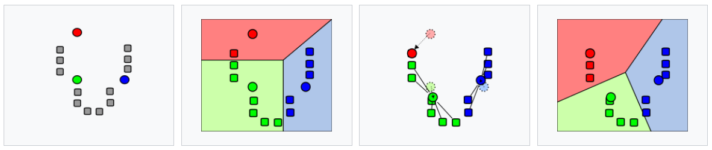
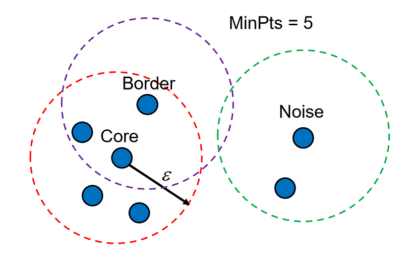
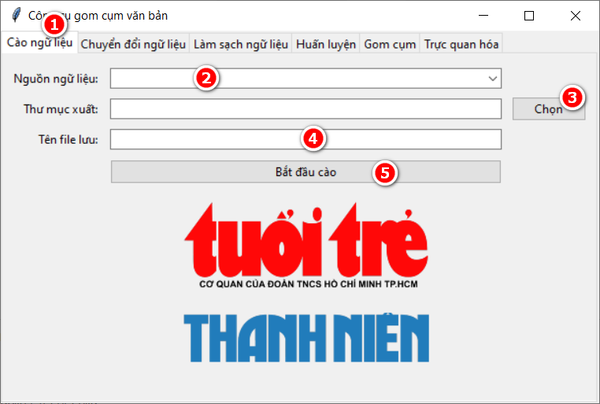

Xây dựng một công cụ gom cụm văn bản hiệu quả bằng Python, bao gồm các chức năng: cào ngữ liệu từ internet, chuyển đổi định dạng ngữ liệu, làm sạch ngữ liệu, huấn
luyện mô hình, dự đoán nhóm cụm, và trực quan hóa kết quả. Công cụ sẽ tích hợp các mô hình gom cụm phổ biến như K-Means, DBSCAN và cho phép người dùng tùy chỉnh các tham
số liên quan.

*Mô hình K-Means*

*Mô hình DBSCAN*

*Giao diện chính của ứng dụng*

